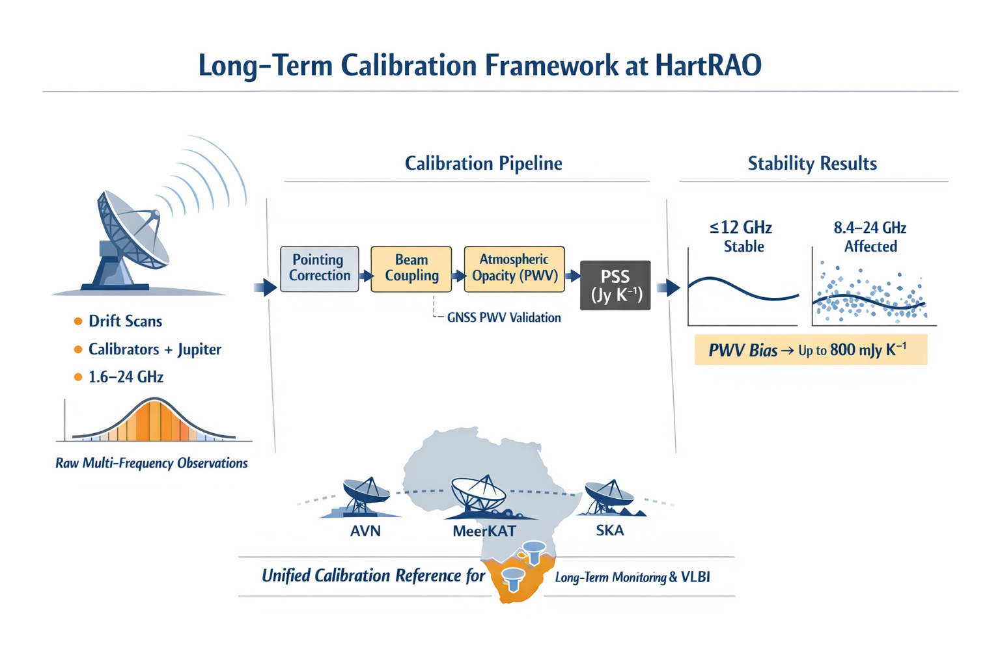

HartRAO Calibration Framework
=============================

Drift-scan observations are processed through a unified calibration framework to 
quantify point-source sensitivity stability, revealing frequency-dependent 
limitations and establishing a long-term calibration reference for HartRAO.

